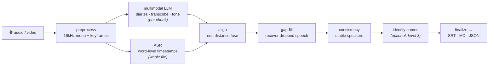

<div align="center">

# offmute-v2 🎙️⏱️

### `npx offmute-v2 meeting.mp4`

**Timestamp-correct, diarized meeting transcription.** Point it at a video or audio file and get
back a transcript where every speaker turn lands on the right millisecond — labelled with the
speaker's name (when it can be inferred) and their tone — as **SRT**, **Markdown**, and **JSON**.

[](https://www.npmjs.com/package/offmute-v2)
[](LICENSE)
[](#requirements)

📝 **Read the full write-up — _"offmute-v2: GLM vs Opus"_ — coming soon at
[southbridge.ai/blog/offmute-v2-glm-vs-opus](http://southbridge.ai/blog/offmute-v2-glm-vs-opus)**

</div>

---

It's the successor to [offmute](https://github.com/southbridgeai/offmute): the same great diarized,
tone-aware transcripts — now with **real timestamps**, SRT output, a resumable pipeline, and a
browser build. No single model is good at everything, so offmute-v2 uses each for what it's best at
and **fuses** them.

```bash
export GEMINI_API_KEY=...        # multimodal understanding (or GOOGLE_API_KEY)
export ASSEMBLYAI_API_KEY=...    # word-level timing

npx offmute-v2 meeting.mp4 -i "Panel of founders; label them by name."
# → meeting.srt   meeting.md   meeting.json
```

That's it. `bunx offmute-v2 meeting.mp4` works too.

## What you get

A clean, sub-second-aligned, speaker-labelled transcript with tone — same content rendered three ways:

**`meeting.srt`** (drop straight onto the video):

```srt
1
00:00:00,160 --> 00:00:00,720
Speaker D: GPU

2
00:00:01,199 --> 00:00:05,440
Presenter: And I'm inspired. I think I'm going to apply to NTU this fall. (confident, joking)
```

**`meeting.md`** (skimmable, grouped by speaker, with talk-time):

```markdown
*Duration: 1914s · Speakers: 5*

## Speakers
- **Presenter** (1461s)
- **Speaker B** (97s)  ·  **Speaker C** (87s)  ·  ...

## Transcript
[00:00] **Speaker D**: GPU
[00:01] **Presenter** *(confident, joking)*: And I'm inspired. I think I'm going to apply to NTU this fall.
```

**`meeting.json`** — every segment with `start`/`end`, `speaker`, `text`, `tone[]`, `timingSource`,
`confidence`, and word-level timings — for downstream tooling.

## Why it's accurate

LLMs are brilliant at *understanding* speech (who's talking, through interruptions, in a crowd,
with tone) but [terrible at timestamps](#how-it-works). ASR models are the opposite: sub-second
timing, but mediocre diarization and no sense of tone. offmute-v2 runs **both** and marries them:

| Job | Tool | Why |
|-----|------|-----|
| **WHO / HOW** — speakers, names, tone, hard audio | multimodal **LLM** (Gemini) | infers names from context, hears tone, handles crowds & interruptions |
| **WHEN** — word-level timestamps | **ASR** (AssemblyAI / Groq Whisper) | sub-second accurate; LLM timestamps drift *minutes* over a long file |
| **fuse** | edit-distance **alignment** | transfers the ASR's clock onto the LLM's richer words |



**Measured** on a hand-checked 32-minute talk (founder presentation + audience Q&A): **≈8% word
error rate** and **~99% word-level speaker attribution**, with turn boundaries riding AssemblyAI's
word timing (first cue at `00:00:00,160`, exactly matching ground truth). Full methodology, runs,
and an independent re-score live in [`docs/`](#receipts--how-this-repo-was-built) and the article.

## Features

- 🎯 **Timestamp-correct** — word-level timing from ASR, fused onto LLM text by alignment.
- 🎭 **Diarization + tone** — separates speakers through interruptions; annotates `(laughing)`,
  `(hesitant)`, `(confident)`, …
- 🧑‍🤝‍🧑 **Three levels of speaker labelling** — separation → stable `Speaker A/B` → real names
  inferred from context (`--level 3`).
- 🎬 **Video-aware** — samples keyframes for visual context (who's on screen, demos, slides).
- ⚡ **Chunked + concurrent** — long files are split with overlap and stitched back with
  **ownership-partition** dedup (no double-printed sentences at chunk seams).
- ♻️ **Resumable & stoppable** — every stage caches to disk; re-runs skip finished work, Ctrl-C
  leaves partials. The cache is keyed on the input **and** the config, so changing `--model` never
  serves you a stale transcript.
- 🔀 **Pluggable providers** — Gemini for the LLM; AssemblyAI *or* Groq Whisper for timing.
- 🌐 **Runs in the browser** — a pure, node-free core + `fetch` providers + ffmpeg.wasm.
- 🔎 **Fully inspectable** — every LLM prompt+response is logged to `llm-calls.jsonl`; all
  intermediates are plain JSON.

## Usage

### CLI

```bash
npx offmute-v2 <input> [options]
```

| Option | Default | Description |
|--------|---------|-------------|
| `-o, --output <dir>` | `./output` | where to write `*.srt` / `*.md` / `*.json` |
| `--instructions <text>` | – | guide diarization / labelling, e.g. `"host is Alice; group callers as 'Caller'"` |
| `--model <name>` | `gemini-2.5-flash` | multimodal LLM (`gemini-2.5-pro`, `gemini-3.1-pro-preview`, `gemini-flash-latest`, …) |
| `--level <1\|2\|3>` | `2` | 1 = separation · 2 = stable anon · 3 = identify names |
| `--timestamped <p>` | `assemblyai` | timing provider: `assemblyai` · `whisper-groq` · `none` |
| `--reasoner <name>` | `deepseek-chat` | text model for the name-identification pass (level 3) |
| `--chunk-seconds <n>` | `600` | chunk length · `--overlap-seconds` (default `60`) |
| `--formats <list>` | `srt,md,json` | which outputs to write |
| `--passes <list>` | all | run/resume a subset of stages |
| `--force` | – | ignore caches and recompute |
| `--only-chunk <n>` | – | process a single chunk (debugging) |
| `-i, --intermediates <dir>` | auto | cache dir (auto-derived per input) |

```bash
npx offmute-v2 meeting.mp4 --level 3                       # name the speakers
npx offmute-v2 meeting.mp4 --model gemini-2.5-pro          # higher quality
npx offmute-v2 talk.mov   --timestamped whisper-groq       # free/fast timing, no AssemblyAI
npx offmute-v2 meeting.mp4 --passes align,consistency,finalize   # resume from cache
```

### Library

The primary line takes a single options object (`input` and `outputDir` are required):

```ts
import { transcribe } from "offmute-v2";

const { segments, speakers, metadata } = await transcribe({
  input: "meeting.mp4",
  outputDir: "./out",
  model: "gemini-flash-latest",
  level: 3,
  instructions: "Three-person panel; label by name.",
  formats: ["srt", "md", "json"],
  apiKeys: { gemini: "...", assemblyai: "..." }, // optional; falls back to env
});

console.log(segments[0]); // { start, end, speaker, text, tone, timingSource, ... }
```

Individual stages (`alignSegments`, `assignGlobalSpeakers`, `finalizeSegments`, formatters, …) are
exported too, so you can build your own pipeline.

### Browser

The fusion core (align / consistency / identify / finalize / format) is pure TypeScript with **zero
node-only imports**, so it bundles tiny and runs in the browser via `offmute-v2/browser` — using
`fetch`-based providers and `ffmpeg.wasm` for in-browser audio extraction. See
[`docs/`](#receipts--how-this-repo-was-built) / the browser example for the integration seam.

## How it works

A multi-stage pipeline where each stage persists a JSON intermediate (so it's resumable and
debuggable):

1. **preprocess** — ffmpeg → 16 kHz mono FLAC + scene-aware keyframes (a 9.6 GB `.mov` becomes a
   ~76 MB FLAC in seconds).
2. **describe** — a quick multimodal pass builds a meeting summary + speaker roster to prime
   transcription.
3. **llm-transcribe** — each chunk goes to the LLM for verbatim text, diarization, and tone. Output
   is plain text with coarse `mm:ss` markers, parsed leniently (truncated text degrades gracefully
   where truncated JSON would be unrecoverable — a lesson from [ipgu](#credits)).
4. **timestamped** — the whole file goes to ASR for word-level timing + a speaker backbone.
5. **align** — the heart: the LLM's token stream is aligned against the ASR word stream with a
   Needleman–Wunsch edit-distance DP, transferring accurate word times onto the richer LLM text.
6. **gap-fill** — anywhere ASR heard speech that no LLM segment covers, an ASR fallback is inserted
   so nothing is dropped.
7. **consistency** — the ASR voice clusters act as a global backbone, merging the LLM's per-chunk
   labels into stable speakers (and fixing ASR over-splits).
8. **identify** *(level 3)* — a reasoning model maps `Speaker A` → real names using context + a
   voice-cluster hint.
9. **finalize** — overlap fixes, clamping, readable subtitle-sized blocks, and SRT/MD/JSON.

> [!NOTE]
> The hard parts of this problem are **chunk overlap** and **alignment**. offmute-v2 partitions
> overlap by *ownership* (each word is emitted by exactly one chunk) so sentences are never
> double-printed at seams, and aligns the *whole* chunk in one DP pass so common words like "it"
> can't mis-match to a later occurrence.

## Built twice, in the open: GLM vs Opus

This repo is also an **agent-vs-agent experiment**. offmute-v2 was built **twice, from one identical
prompt**, by two different models running in **Claude Code** — a head-to-head on a hard,
AI-resistant build (fusing the ideas of [offmute], [meeting-diary], and [ipgu] into one
timestamp-accurate diarizer):

| Branch | Built by | npm tag | What it is |
|--------|----------|---------|------------|
| [`master`](../../tree/master) | GLM line + post-launch fixes | `offmute-v2@latest` | the daily-driven, hardened build (this README) |
| [`glm`](../../tree/glm) | **GLM-5.2** | `offmute-v2@glm` | the frozen GLM experiment build |
| [`opus`](../../tree/opus) | **Claude Opus 4.8** | `offmute-v2@opus` | the frozen Opus experiment build |

```bash
npx offmute-v2@glm   meeting.mp4   # the GLM build, exactly as submitted
npx offmute-v2@opus  meeting.mp4   # the Opus build, exactly as submitted
```

The `glm` and `opus` branches have **independent histories** — each is the full, unedited commit
trail of that model's build, every review round, and every fix. The headline finding (spoiler):
once a chunk-overlap dedup bug is accounted for, the two are a near dead-heat on accuracy, and the
differences are in code conventions, error DX, and packaging. The full analysis is in the article.

## Receipts & how this repo was built

Everything is open for inspection:

- **Per-branch review trails** (on [`glm`](../../tree/glm/docs) / [`opus`](../../tree/opus/docs)):
  `docs/spec.md`, `docs/review-1/`, `docs/review-2/` (run-throughs, code reads, an independent
  review, and each model's diagnosed fixes), and the append-only `intermediates/process_log_*.md`
  dev journals.
- **Releasing & npm tags:** [`RELEASING.md`](RELEASING.md) — published via GitHub Actions **npm
  Trusted Publishing (OIDC)**, no tokens, with provenance.

## Diarization levels

1. **Separation** — who speaks when.
2. **Anonymous-consistent** — `Speaker A/B`, stable across the whole file *(default)*.
3. **Identification** — real names inferred from context (needs `DEEPSEEK_API_KEY`, or point
   `--reasoner` at another provider). Use `--instructions` to steer (e.g. *"everyone except the
   host is 'Audience'"*).

## Requirements

- **Node ≥ 20** and **`ffmpeg`/`ffprobe`** on `PATH` (CLI / library). The browser build uses
  ffmpeg.wasm instead.
- **API keys** (from env or the `apiKeys` option):
  - `GEMINI_API_KEY` (or `GOOGLE_API_KEY`) — required.
  - `ASSEMBLYAI_API_KEY` — required for timing (or use `--timestamped whisper-groq` + `GROQ_API_KEY`).
  - `DEEPSEEK_API_KEY` — optional, for `--level 3` name identification.

## Development

```bash
git clone https://github.com/SouthBridgeAI/offmute-v2.git
cd offmute-v2                 # master = the primary build
npm ci
npm run typecheck && npm run lint && npm test
npm run build                # tsup → dist/ (node + browser bundles)
npm run dev -- meeting.mp4   # run from source
```

To compare against the experiment builds, check out the [`glm`](../../tree/glm) or
[`opus`](../../tree/opus) branch (the Opus build uses Bun: `bun install && bun run build`).

## Credits

Built on three predecessors, with their hard-won lessons carried forward:

- **[offmute]** — multimodal describe→transcribe, diarization, tone.
- **[meeting-diary]** — ASR word-timestamps + speaker diarization.
- **[ipgu]** — chunk/merge discipline and structured extraction from LLM output.

Created by [Southbridge](https://southbridge.ai). Thanks to the model teams — including
[z.ai](https://z.ai) for GLM-5.2 and Anthropic for Claude Opus.

**License:** Apache-2.0.

[offmute]: https://github.com/southbridgeai/offmute
[meeting-diary]: https://github.com/southbridgeai/meeting-diary
[ipgu]: https://github.com/hrishioa/ipgu
